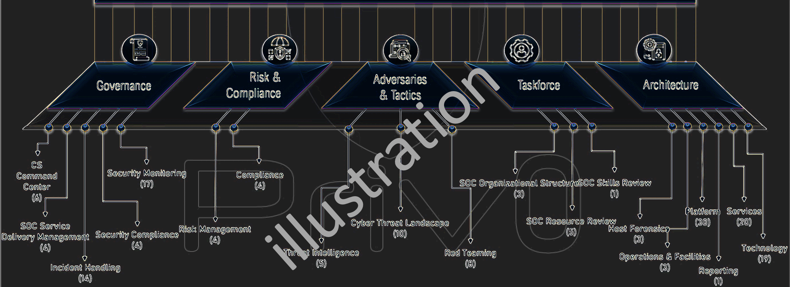

---

layout: col-document
title: OWASP Cyber Defense Framework
tags: example-tag
level: 2
type: 
pitch: A very brief, one-line description of your project

---

The Cyber Defense Framework (CDF) addresses various challenges and key requirements to secure your IT infrastructure against emerging Cyber Threats. Based on 5 domains, the controls set out clear expectations to evaluate the maturity to be in place at the Cyber Defense Center or Security Operation Center to protect their organization. CDF will play a vital role at organizations in designing a comprehensive Roadmap.

This can be extremely handy for the organizations as well that have outsourced the related functions to third parties and need to ensure if they really have them covered.

Stay tuned, Framework publishing soon...

### Join the Research Team
If you have the relevant work experience and/or conducted research with the related and interested to join the team in enhancing the CDF, get in touch with the project leader.

## Licensing

OWASP CDF is free to use. It is licensed under the [Creative Commons Attribution-ShareAlike 3.0 license](http://creativecommons.org/licenses/by-sa/3.0/), so you can copy, distribute and transmit the work, and you can adapt it, and use it commercially, but all provided that you attribute the original OWASP CDF and if you alter, transform, or build upon this work, you may distribute the resulting work only under the same or similar license to this one.

### Acknowledgements
- Team at Priv0.com
- More coming soon...
